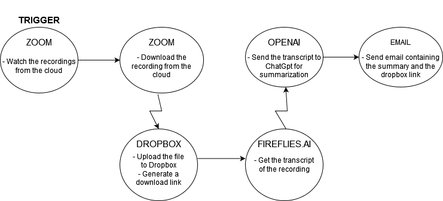

# 🎥 AI-Powered Zoom Meeting Automation Flow

## Overview

This project provides a **fully automated end-to-end flow** using [Make.com](https://www.make.com/) and external services to handle **Zoom meeting recordings**. Once a Zoom meeting ends, the system:

1. Downloads the cloud recording.
2. Uploads it to Dropbox.
3. Sends the file to **Fireflies.ai** for transcription.
4. Summarizes the transcript using **OpenAI ChatGPT**.
5. Emails the final result (Dropbox link + summary).

The automation eliminates manual tasks and ensures meeting information is accessible, summarized, and shareable right after each session.

---

## 🧠 Use Case

> After a Zoom meeting that was scheduled via Google Calendar and recorded in the cloud ends:
>
> - Automatically handle the recording
> - Generate and summarize transcripts
> - Distribute them via email

---

## 🔗 Tools & Integrations

| Tool        | Purpose                                   |
|-------------|-------------------------------------------|
| Zoom        | Source of recorded meeting                |
| Dropbox     | File storage and link generation          |
| Fireflies.ai| Transcription of audio                    |
| OpenAI      | Transcript summarization with ChatGPT     |
| Gmail       | Sending summary and links via email       |
| Make.com    | Workflow automation orchestration         |

---

## 🛠️ Flow Diagram

### 🧭 Logic Flow

Zoom (Watch Recordings)

↓

Zoom (Download Cloud Recording)

↓

Dropbox (Upload file)

↓

Dropbox (Generate Share Link)

↓

Fireflies.ai (Get Transcript)

↓

OpenAI ChatGPT (Summarize)

↓

Gmail (Send Email with Summary & Dropbox Link)

---

#### 1. Logic Representation  



#### 2. Make.com Scenario  
[Make Scenario](/misc/flow.png)

## 🧩 Make.com Scenario Configuration

### Module Breakdown:

1. **Zoom - Watch Recordings**
   - Trigger: After a Zoom meeting ends and is available in the cloud
   - Filter: Ensure meeting was scheduled in Google Calendar (via ID, tags, etc.)

2. **Zoom - Download Cloud Recording**
   - Action: Download the audio/video file from Zoom

3. **Dropbox - Upload a File**
   - Action: Upload the Zoom recording to Dropbox
   - Output: File path / File ID

4. **Dropbox - Create Share Link**
   - Action: Generate a public Dropbox URL for the file

5. **Fireflies.ai - Get Transcript**
   - Action: Submit recording or Dropbox link for transcription
   - Output: Raw transcript text

6. **OpenAI - ChatGPT**
   - Action: Send the transcript text to ChatGPT
   - Prompt Example:
     ```text
     Summarize the following transcript in a clear, concise manner, highlighting key topics, decisions, and action items:
     [INSERT TRANSCRIPT]
     ```

7. **Gmail - Send Email**
   - Action: Send the final output to a recipient
   - Content:
     ```
     Subject: Summary of [Meeting Name]

     Hello,

     The recording of the meeting is available here: [Dropbox Link]

     Here is the summary of the meeting:
     [ChatGPT Summary]

     Regards,
     Automation Bot
     ```

---

## 🔐 API & Authentication Setup

### Zoom
- OAuth or JWT App
- Required Scope: `recording:read`

### Dropbox
- Access Token (OAuth2)
- Permissions: `files.content.write`, `sharing.read`

### Fireflies.ai
- API Key or Linked Dropbox integration

### OpenAI
- API Key from https://platform.openai.com
- Model: `gpt-4` or `gpt-3.5-turbo`

### Gmail
- Gmail connection via Make OAuth
- Ensure correct sending permissions

How to link personal gmail with Make

1. Go to https://console.cloud.google.com/

   1. Make sure you're signed into the right account

   2. Create New Project > Name: makedotcom

2. Dashboard > APIs and services > Enable > Gmail API

   1. OAuth consent screen > External  
      • App name: makedotcom  
      • Select email  
      • Add authorized domains  
           • Make.com  
           • Integromat.com  
      • Add contact email

   2. Scopes (what permissions are allowed)  
      1. Add > Gmail API  
         • mail.google.com  
         • .modify  
         • .compose  
         • .readonly  
         • .metadata  
         • .insert  
         • .send  
         • .labels  
      2. Update > Save and continue

   3. Test users > add your email

3. Credentials > Create Credentials > OAuth client ID  
   o Web apolication > any name eg makedotcom  
   o Authorized redirect URIs  
     • https://www.integromat.com/outh/cb/ google-restricted

4. Done! You got your Client ID and Client Secret, used to connect to your gmail.

5. Add them to Make Gmail module

---

## ✅ Pre-requisites

- Verified accounts on all platforms
- Pre-scheduled Zoom meeting via Google Calendar
- Zoom recording must be saved to the cloud
- File size and format must be compatible with Dropbox and Fireflies.ai

---

## 🚦 Error Handling

- **File not found** → Add delay to wait for Zoom to finish processing
- **Transcription failure** → Retry after delay or fallback to Whisper API
- **OpenAI timeout or truncation** → Use chunking for large transcripts
- **Email delivery failure** → Retry logic or add webhook alert

---

## 🧪 Testing the Flow

1. Schedule a test Zoom meeting via Google Calendar
2. Record and end the meeting
3. Check Dropbox for upload
4. Check Fireflies for transcript status
5. Confirm email summary delivery

---

## 👨‍💻 Author

**Vlad Panait**  
Automating your post-meeting workflows, one Zoom call at a time.

---
